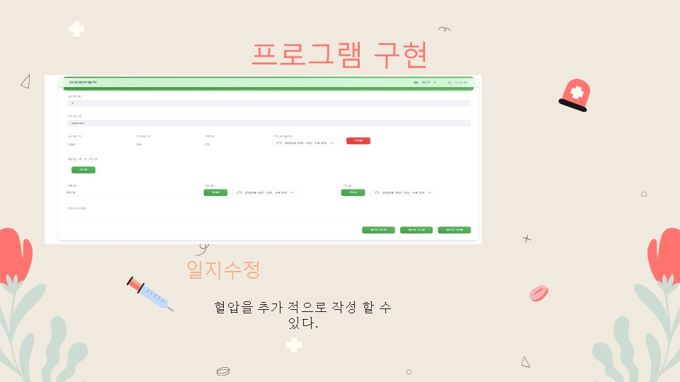

<!-- Improved compatibility of back to top link: See: https://github.com/othneildrew/Best-README-Template/pull/73 -->

<!--
*** Thanks for checking out the Best-README-Template. If you have a suggestion
*** that would make this better, please fork the repo and create a pull request
*** or simply open an issue with the tag "enhancement".
*** Don't forget to give the project a star!
*** Thanks again! Now go create something AMAZING! :D
-->

<!-- PROJECT SHIELDS -->
<!--
*** I'm using markdown "reference style" links for readability.
*** Reference links are enclosed in brackets [ ] instead of parentheses ( ).
*** See the bottom of this document for the declaration of the reference variables
*** for contributors-url, forks-url, etc. This is an optional, concise syntax you may use.
*** https://www.markdownguide.org/basic-syntax/#reference-style-links
-->

<!-- PROJECT LOGO -->
 

###### readme-top

  

<h3 align="center">건강관리 일지</h3>

  

    MEVN Project

     
    
작업기간 : 2023.08.24~2024.02.16

  <a href="https://mevn.ovmkas.co.kr/" target="_blank">View Demo</a>

<!-- TABLE OF CONTENTS -->

  
목차

  <ol>
    <li>
      <a href="#about-the-project">About The Project</a>
      <ul>
        <li><a href="#built-with">Built With</a></li>
      </ul>
    </li>
    <li>
        <a href="#데이터베이스">데이터베이스</a>
    </li>
    <li>
        <a href="#개발환경">개발 환경</a>
    </li>
    <li>
	    <a href="#사용방법">사용방법</a>
    </li>
    <li>
	    <a href="#요구사항">요구사항</a>
    </li>
    <li>
	    <a href="#Etc">Etc</a>
	    <ul>
		    <li><a href="#PPT">PPT</a></li>
		    <li><a href="#프로젝트후기">프로젝트 후기</a></li>
	    </ul>
    </li>
    <li><a href="#Contact">Contact</a></li>
    <li>
	    <a href="#Acknowledgments">Acknowledgments</a>
	    <ul>
		    <li><a href="#References">References</a></li>
	    </ul>
    </li>
  </ol>

<!-- ABOUT THE PROJECT -->
## About The Project

 
MEVN Project  
Redis를 활용한 JWT 회원제 게시판

### Built With

 

 
 
 
 

(<a href="#readme-top">back to top</a>)

<!-- 데이터베이스 -->
### 데이터베이스

  

<!-- 개발환경 -->
### 개발환경

1. MONGODB
2. EXPRESS
3. VUE
4. NODE
5. REDIS
6. MONGODB COMPASS
7. Pinia-Plugin-Persistedstate

(<a href="#readme-top">back to top</a>)

<!-- 사용방법및기능소개 -->
## 사용방법

#### 사용방법
<pre>
※ 일반회원

1. 회원가입
2. 로그인 (demo 페이지 기준 guest/guest0216 입력)
3. 게시판
 	3-1. 공지사항 게시판확인
	3-2. 일지 - 글작성
    3-3. 일지 - 조회
    3-4. 일지 - 상세보기
    3-5. 일지 - 삭제

※ 관리자

1. 게시판
    1-1. 공지사항 글 작성
    1-2. 공지사항 글 수정
    1-3. 공지사항 글 삭제
</pre>

(<a href="#readme-top">back to top</a>)

<!-- ROADMAP -->
## 요구사항

### 작업목록
- [x] 작업완료
- [ ] 작업예정

#### 일반 회원
- [x] 회원가입
    - [x] 이름, ID, Password, 성별 입력으로 회원가입
- [x] 로그인
- [x] 회원상세조회
- [x] 회원수정
    - [x] 이름, Password 수정 가능
- [x] 회원탈퇴
    - [x] 회원정보, 게시글 삭제
- [x] 게시판
    - [x] 공지사항 게시판 조회
    - [x] 일지조회
    - [x] 일지쓰기
    - [x] 일지삭제

 

#### 관리자
- [x] 공지사항
    - [x] 공지사항 글 쓰기
    - [x] 공지사항 글 수정
    - [ ] 특정 사용자 게시물 조회

(<a href="#readme-top">back to top</a>)

<!-- LICENSE -->
## Etc

#### PPT

PPT Images

 

<!-- 프로젝트 후기 -->
#### 프로젝트후기

<pre>
처음 접해보는 MEVN프로젝트여서 초반에 프로젝트를 진행함에 있어서 많이 힘들었지만 
그 덕분에 회원관련 JWT,COOKIE 관련 정보를 많이 찾아보게 되었고,
JavaScript를 많이 배울 수 있게 된 것 같아 좋았습니다
</pre>

(<a href="#readme-top">back to top</a>)

<!-- CONTACT -->
## Contact

Lee Dong Geon - ovmkas@gmail.com

<a href="https://www.ovmkas.co.kr" target="_blank">Portfolio Link</a>

(<a href="#readme-top">back to top</a>)

<!-- ACKNOWLEDGMENTS -->
## Acknowledgments

프로젝트에 관심 가져주셔서 감사합니다!  
궁금한 사항은 
ovmkas@gmail.com
로 부탁드립니다

### References
README Template : [README-Template](https://github.com/othneildrew/Best-README-Template) 
VUE Template: [Creative Tim](https://demos.creative-tim.com/vue-material-kit/?_ga=2.214302814.816472569.1692249839-1215412141.1690963757#/) 

(<a href="#readme-top">back to top</a>)

